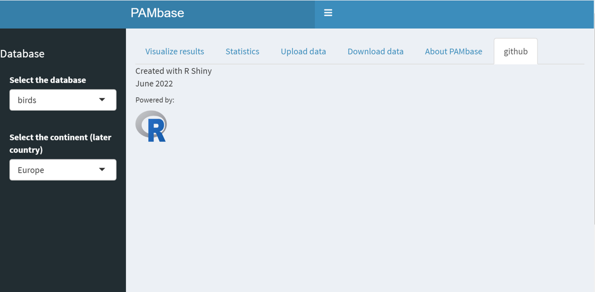

  # PAMbase
   
   ## Table of Contents
* [General Info](#general-information)
* [Technologies Used](#technologies-used)
* [Screenshots](#screenshots)
* [Setup](#setup)
* [Usage](#usage)
* [Project Status](#project-status)
* [Room for Improvement](#room-for-improvement)
* [Acknowledgements](#acknowledgements)
* [Contact](#contact)
   
   
  
  ## General Information
PAMbase is a prototype repository for passive acoustic monitoring data combining different soundscape research interests, such as biodiversity, noise pollution, aquatic ecosystems etc. The objective is to create a database which researchers from different fields can use to collect and exchange acoustic data.
  
 ## Technologies used
 Project is created with:
 * RStudio Desktop: 2022.07.1+554
 * R shiny app - version 4.2.0
 * Link: insert Link (_not public yet_)
 
 
## Screenshots
_exchange screenshot after publication_

## Setup
Project requirements:
- R:
https://techvidvan.com/tutorials/install-r/
- RStudio Desktop (latest version recommended):
https://www.rstudio.com/products/rstudio/download/

## Usage
How does one go about using it?
--> various use cases and code examples here.

`write-your-code-here`

## Project Status
Project is: _in progress_ 

## Room for Improvement
Include areas you believe need improvement / could be improved. Also add TODOs for future development.

Room for improvement:
- Improvement to be done 1
- Improvement to be done 2

To do:
- Feature to be added 1
- Feature to be added 2

## Acknowledgements
Give credit here.
- This project was inspired by...
- Many thanks to...

## Contact
Created by ...

